---
# Front matter
lang: ru-RU
title: **"Отчет по лабораторной работе №5"**
subtitle: *"Операционные системы"*
author: "Диана Денисовна Нитусова"

# Formatting
toc-title: "Содержание"
toc: true # Table of contents
toc_depth: 2
lof: true # List of figures
lot: true # List of tables
fontsize: 12pt
linestretch: 1.5
papersize: a4paper
documentclass: scrreprt
polyglossia-lang: russian
polyglossia-otherlangs: english
mainfont: PT Serif
romanfont: PT Serif
sansfont: PT Sans
monofont: PT Mono
mainfontoptions: Ligatures=TeX
romanfontoptions: Ligatures=TeX
sansfontoptions: Ligatures=TeX,Scale=MatchLowercase
monofontoptions: Scale=MatchLowercase
indent: true
pdf-engine: lualatex
header-includes:
  - \linepenalty=10 # the penalty added to the badness of each line within a paragraph (no associated penalty node) Increasing the value makes tex try to have fewer lines in the paragraph.
  - \interlinepenalty=0 # value of the penalty (node) added after each line of a paragraph.
  - \hyphenpenalty=50 # the penalty for line breaking at an automatically inserted hyphen
  - \exhyphenpenalty=50 # the penalty for line breaking at an explicit hyphen
  - \binoppenalty=700 # the penalty for breaking a line at a binary operator
  - \relpenalty=500 # the penalty for breaking a line at a relation
  - \clubpenalty=150 # extra penalty for breaking after first line of a paragraph
  - \widowpenalty=150 # extra penalty for breaking before last line of a paragraph
  - \displaywidowpenalty=50 # extra penalty for breaking before last line before a display math
  - \brokenpenalty=100 # extra penalty for page breaking after a hyphenated line
  - \predisplaypenalty=10000 # penalty for breaking before a display
  - \postdisplaypenalty=0 # penalty for breaking after a display
  - \floatingpenalty = 20000 # penalty for splitting an insertion (can only be split footnote in standard LaTeX)
  - \raggedbottom # or \flushbottom
  - usepackage{float} # keep figures where there are in the text
  - \floatplacement{figure}{H} # keep figures where there are in the text
---

# Цель работы

**Цель:** Приобретение практических навыков взаимодействия
пользователя с системой посредством командной строки.

# Задание

**Задание:** Изучить командную строку.

# Выполнение лабораторной работы

**Ход работы:**
Определяем полное имя домашнего каталога, используя команду
«pwd» (рис. -fig:001)

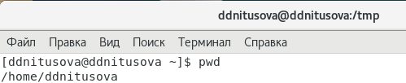{#fig:001 width=70% }

Переходим в каталог /tmp, используя команду «cd /tmp» (рис. -fig:002) (рис. -fig:003)

Выводим на экран содержимое каталога /tmp, используя команду
«ls» с различными опциями:

«ls» − выводится список каталогов и файлов, которые можно
увидеть, «вручную» открыв каталог tmp

«ls -a» − к списку, описанному в предыдущем пункте,
добавляются скрытые каталоги и файлы (их имена начинаются с
точки)

«ls -F» − с помощью этой команды получаем информацию о
типах файлов

«ls -l» − получаем список каталогов и файлов, но уже с более
подробной информацией о них

«ls -alF» − данная команда отобразит список всех каталогов и
файлов, в том числе и скрытых, с подробной информацией о них

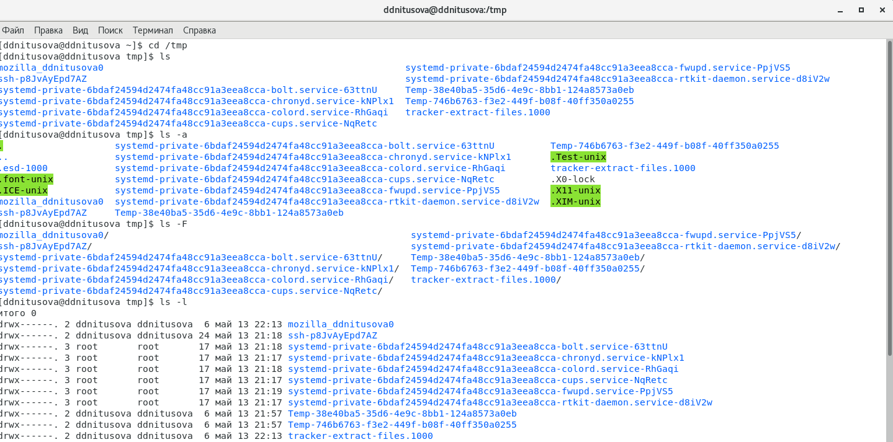{#fig:002 width=70% }
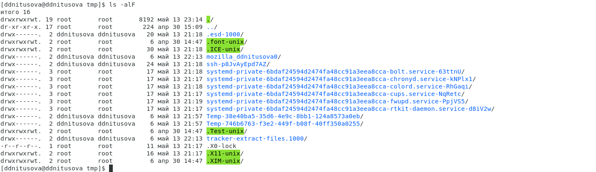{#fig:003 width=70% }

Переходим в каталог «cd /var/spool» и просматриваем содержимое. Видим, что подкаталог crone есть.(рис. -fig:004)

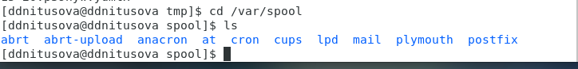{#fig:004 width=70% }

Далее перехожу в свой домашний каталог с помощью команды «cd ~» и, используя команду «ls -alF», выводим на экран его содержимое. Владельцем всех каталогов является ddnitusova, кроме родительского каталога (его владелец пользователь root из группы пользователей root) (рис. -fig:005)

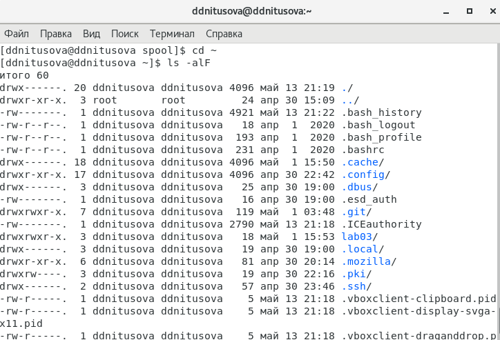{#fig:005 width=70% }

В домашнем каталоге создаем новый каталог newdir, используя команду «mkdir newdir». Командой «cd newdir» переходим в ранее созданный каталог и там создаем каталог morefun, используя команду «mkdir morefun». Используя команду «mkdir letters memos misk», создаем в домашнем каталоге три новых. Далее с помощью команды «rm –r letters memos misk» удаляем созданные каталоги. (рис. -fig:006)

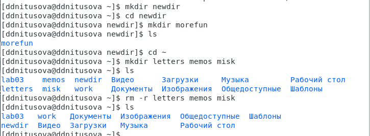{#fig:006 width=70% }

Пробуем удалить каталог newdir командой «rm newdir». Получаем отказ в выполнении команды.Удаляем каталог newdir/morefun, используя команду «rm –r newdir/morefun». Командой «ls» проверяем правильность выполненного действия. (рис. -fig:007)

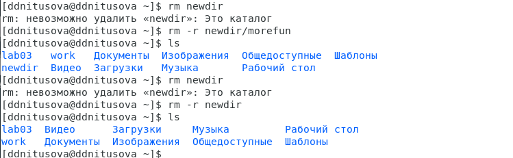{#fig:007 width=70% }

Используя команду «man ls», определяю, какую опцию команды ls необходимо использовать, чтобы просмотреть содержимое не только указанного каталога, но и подкаталогов, входящих в него. (рис. -fig:008)
{#fig:008 width=70% }

Используя то же руководство по команде «ls», открытое в предыдущем пункте, определяю набор опций команды ls, позволяющий отсортировать по времени последнего изменения выводимый список содержимого каталога с развернутым описанием файлов. (рис. -fig:009) (рис. -fig:010) (рис. -fig:011)
{#fig:009 width=70% }
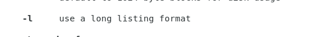{#fig:010 width=70% }
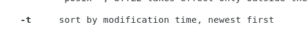{#fig:011 width=70% }

Используя команды «man cd», «man pwd», «man mkdir», «man rmdir», «man rm», просматриваю описание соответствующих команд:

Команда cd (рис. -fig:012):

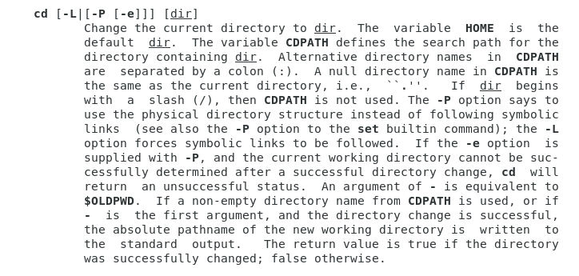{#fig:012 width=70% }

Команда pwd (рис. -fig:013):
-L, --logical
не разыменовывать символические ссылки. Если путь содержит
символические ссылки, то выводить их без преобразования в
исходный путь;

-P, --physical
преобразовывать (отбрасывать символические ссылки)
символические ссылки в исходные имена. Если путь содержит
символические ссылки, то они будут преобразованы в названия
исходных директорий, на которые они указывают;

--help
показать справку по команде pwd;

--version
показать версию утилиты pwd

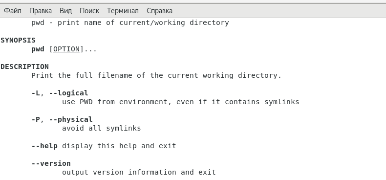{#fig:013 width=70% }

Команда mkdir (рис. -fig:014):
-m, --mode=MODE
устанавливает права доступа для создаваемой директории.
Синтаксис MODE такой же как у команды chmod;

-p, --parents
создать все директории, которые указаны внутри пути. Если
какая-либо директория существует, то предупреждение об этом
не выводится;

-v, --verbose
выводить сообщение о каждой создаваемой директории;

-z
установить контекст SELinux для создаваемой директории по
умолчанию;

--context[=CTX]
установить контекст SELinux для создаваемой директории в
значение CTX;

--help
показать справку по команде mkdir;

--version
показать версию утилиты mkdir

{#fig:014 width=70% }

Команда rmdir (рис. -fig:015):
--ignore-fail-on-non-empty
игнорировать директории, которые содержат в себе файлы;

-p, --parents
в этой опции каждый аргумент каталога обрабатывается как
путь, из которого будут удалены все компоненты, если они уже
пусты, начиная с последнего компонента;

-v, --verbose
отображение подробной информации для каждого
обрабатываемого каталога;

--help
показать справку по команде rmdir;

--version
показать версию утилиты rmdir

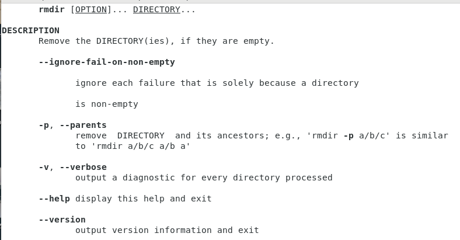{#fig:015 width=70% }

Команда rm (рис. -fig:016):
-f, --force
игнорировать несуществующие файлы и аргументы. Никогда не
выдавать запросы на подтверждение удаления;

-i
выводить запрос на подтверждение удаления каждого файла;

-I
выдать один запрос на подтверждение удаления всех файлов,
если удаляется больше трех файлов или используется
рекурсивное удаление. Опция применяется, как более
«щадящая» версия опции –i;

--interactive[=WHEN]
вместо WHEN можно использовать:
never — никогда не выдавать запросы на подтверждение
удаления.
once — выводить запрос один раз (аналог опции -I).
always — выводить запрос всегда (аналог опции -i).
Если значение КОГДА не задано, то используется always;

--one-file-system
во время рекурсивного удаления пропускать директории,
которые находятся на других файловых системах;

--no-preserve-root
если в качестве директории для удаления задан корневой раздел
/, то считать, что это обычная директория и начать выполнять
удаление;

--preserve-root[=all]
если в качестве директории для удаления задан корневой раздел
/, то запретить выполнять команду rm над корневым разделом.
Данное поведение используется по умолчанию;

-r, -R, --recursive
удаление директорий и их содержимого. Рекурсивное удаление;

-d, --dir
удалять пустые директории;

-v, --verbose
выводить информацию об удаляемых файлах;

--help
показать справку по команде rm;

--version
показать версию утилиты rm

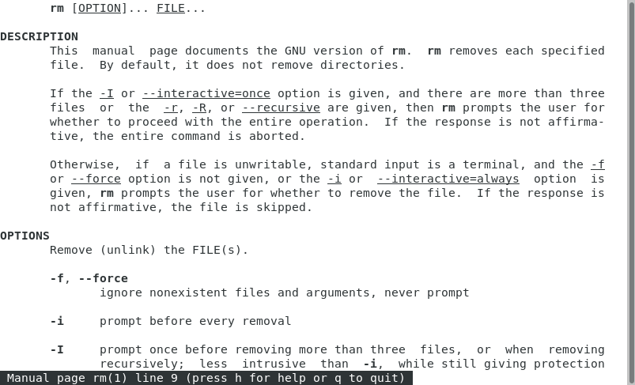{#fig:016 width=70% }

Выведем историю команд с помощью команды «history». Далее, используя команды "!194:s/newdir/newdir1", "!205" выполним команды 194 и 205. (рис. -fig:017) (рис. -fig:018)

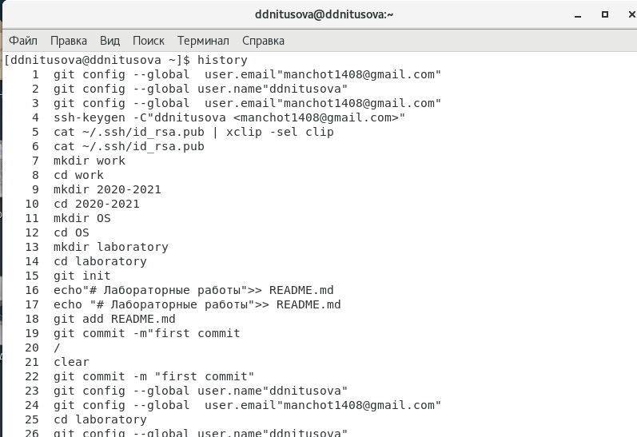{#fig:017 width=70% }
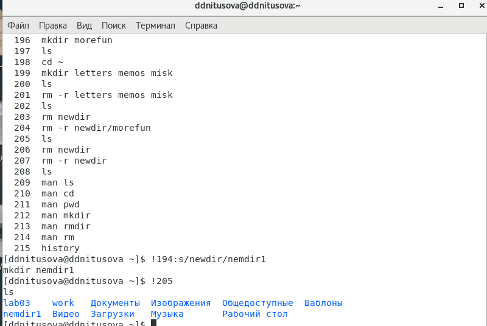{#fig:018 width=70% }

# Выводы

В ходе выполнения данной лабораторной работы я приобрела практические навыки взаимодействия с системой посредством командной строки.

#Контрольные вопросы

1) Командная строка – специальная программа, позволяющая управлять
операционной системой при помощи текстовых команд, вводимых в
окне приложения.

2) Для определения абсолютного пути к текущему каталогу используется
команда pwd (print working directory). Например, команда «pwd» в
моем домашнем каталоге выведет: /home/ddnitusova

3) Команда «ls -F» (или «ls -aF», тогда появятся еще скрытые файлы)
выведет имена файлов в текущем каталоге и их типы.

4) Имена скрытых файлов начинаются с точки. Эти файлы в
операционной системе скрыты от просмотра и обычно используются
для настройки рабочей среды. Для того, чтобы отобразить имена
скрытых файлов, необходимо использовать команду «ls –a». 

5) Команда rm используется для удаления файлов и/или каталогов.
Команда rm -i выдает запрос подтверждения на удаление файла.
Команда rm -r необходима, чтобы удалить каталог, содержащий файлы.
Без указания этой опции команда не будет выполняться. Если каталог
пуст, то можно воспользоваться командой rmdir. Если удаляемый
каталог содержит файлы, то команда не будет выполнена – нужно
использовать «rm -r имя_каталога».
Таким образом, каталог, не содержащий файлов, можно удалить и
командой rm, и командой rmdir. Файл командой rmdir удалить нельзя.

6) Чтобы определить, какие команды выполнил пользователь в сеансе
работы, необходимо воспользоваться командой «history».

7) Чтобы исправить или запустить на выполнение команду, которую
пользователь уже использовал в сеансе работы, необходимо: в первом
случае: воспользоваться конструкцией
!<номер_команды>:s/<что_меняем>/<на_что_меняем>, во втором
случае: !<номер_команды>. 

8) Чтобы записать в одной строке несколько команд, необходимо между
ними поставить ; . Например, «cd /tmp; ls».

9) Символ обратного слэша \ позволяет использовать управляющие
символы ( ".", "/", "$", "*", "[", "]", "^", "&") без их интерпретации
командной оболочкой; процедура добавления данного символа перед
управляющими символами называется экранированием символов.
Например, команда «ls newdir\/morefun» отобразит содержимое
каталога newdir/morefun.

10) Команда «ls -l» отображает список каталогов и файлов с подробной
информацией о них (тип файла, право доступа, число ссылок,
владелец, размер, дата последней ревизии, имя файла или каталога).

11) Полный, абсолютный путь от корня файловой системы – этот путь
начинается от корня "/" и описывает весь путь к файлу или каталогу;
Относительный путь – это путь к файлу относительно текущего
каталога (каталога, где находится пользователь). Например, «cd
/newdir/morefun» – абсолютный путь, «cd newdir» – относительный
путь.

12) Чтобы получить необходимую информацию о команде, необходимо
воспользоваться конструкцией man [имя_команды], либо использовать
опцию help, которая предусмотрена для некоторых команд.

13) Для автоматического дополнения вводимых команд служит клавиша
Tab.

**Вывод:** Я изучила идеологию и применение средств контроля версий.
